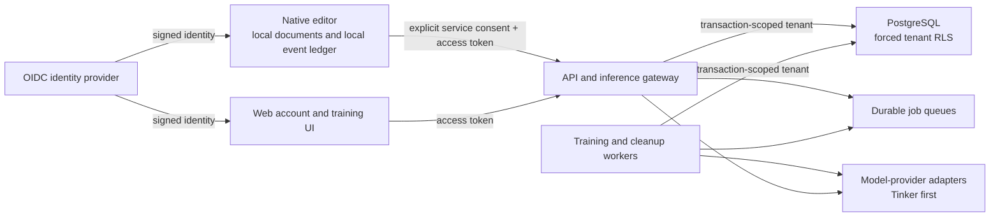

# Service architecture

## Product shape

Shakespeare should become a web-backed service without discarding the native editor. The best near-term shape is a hybrid:

- The macOS app remains the high-quality, local-first writing client and document source of truth.
- A web app handles account management, consent, training status, evaluation comparisons, model rollback, billing, and support.
- A small service control plane owns identity, tenancy, durable jobs, model lifecycle, and provider credentials.
- Browser editing can reuse the TipTap layer later, after document sync and offline conflict semantics are designed deliberately.

Converting the entire product into a web app now would simplify distribution but would weaken the current offline/file workflow and expand the security surface before the core service is proven. The control plane is the leverage point; the editing surface can remain native while the business becomes a service.

## Trust boundaries

The verified token's issuer and subject deterministically produce the tenant ID. No request accepts `tenant_id`, `writer_id`, role, or provider credentials as authorization. PostgreSQL repeats the tenant check with `FORCE ROW LEVEL SECURITY`, so an omitted application filter does not expose another writer's rows. PostgreSQL documents both its default-deny row-security behavior and the special owner/bypass rules that make `FORCE` and non-superuser runtime roles necessary: [Row Security Policies](https://www.postgresql.org/docs/17/ddl-rowsecurity.html).

## Component boundaries

| Component | Owns | Must not own |
|---|---|---|
| `Editor/` | TipTap document behavior and safe JS↔Swift serialization | Accounts, training jobs, model-provider keys |
| `Sources/WordProcessor/` | Local files, consent UI, Keychain, local event capture | Shared service credentials or tenant authorization |
| `Trainer/` | Dataset compilation and provider training recipes | HTTP identity, billing, document sync |
| `Service/` | OIDC, tenancy, API contracts, job state, model lifecycle | Editor behavior or native file I/O |
| Provider adapters | Inference/training protocol translation | Product identity or canonical user state |

## Personalization lifecycle

1. Collection remains off by default. Local collection and service upload are separate consent scopes.
2. The app batches at most 100 versioned events and retries with the same event IDs. The API deduplicates `(tenant_id, event_id)`.
3. A training request requires an `Idempotency-Key`. Reusing the key with different parameters is a conflict, not a second paid run.
4. PostgreSQL creates the run and queue record atomically. A worker claims jobs with a lease, bounded attempts, backoff, and a stable failure code.
5. The worker compiles document-separated train/evaluation sets and records the dataset-manifest digest, recipe, dependency versions, cost, and provider checkpoints.
6. The checkpoint enters `candidate`. It cannot become `active` until automated and human-facing blind comparisons pass.
7. Activation retires the old checkpoint in the same transaction. Rollback is reactivation of a previously passed version.
8. Deletion immediately purges service rows and durably queues provider checkpoint deletion. Completion is not claimed until the provider confirms deletion.

## Deployment invariants

- One API process per Linux container; horizontal replicas sit behind a trusted TLS/load-balancing layer. This follows FastAPI's documented container model and keeps replication in the deployment platform: [FastAPI in Containers](https://fastapi.tiangolo.com/deployment/docker/).
- Migrations use a schema-owner credential in a separate release job. The runtime and worker credentials are non-owner, non-superuser, and never carry `BYPASSRLS`.
- Provider keys, OIDC configuration, database URLs, and signing material come from the platform secret manager, never app bundles or GitHub variables exposed to pull requests.
- API ingress enforces TLS, request limits, per-account rate limits, and a global training budget. The application repeats body and field bounds.
- Training and inference have separate pools and budgets so a training spike cannot starve interactive writing.
- Raw writing events have a short configured TTL. Derived datasets, logs, backups, and provider checkpoints have explicit retention and deletion jobs too.
- Logs contain request IDs, run IDs, stable error codes, durations, and counts—but never prose, prompts, access tokens, API keys, or checkpoint credentials.
- Production releases require CI, image vulnerability scanning, a software bill of materials, provenance, staged rollout, and a tested rollback.

## Tinker boundary

Tinker is the first training adapter, not the product architecture. Its compatible inference API is currently described as beta and intended for testing or low-traffic internal use, so public interactive inference needs a gateway, latency/error budgets, circuit breaking, cost limits, and a fallback before launch. Checkpoint lifecycle operations must be handled by workers rather than exposed to clients. See Tinker's [Anthropic-compatible API](https://tinker-docs.thinkingmachines.ai/tinker/compatible-apis/anthropic/) and [checkpoint lifecycle](https://tinker-docs.thinkingmachines.ai/tinker/cli/checkpoint/) documentation.

## Next implementation slice

1. Choose the OIDC provider, managed PostgreSQL, container runtime, object storage, and monitoring stack.
2. Implement the leased training worker and provider-checkpoint deletion worker against the existing queues.
3. Add a server-side inference endpoint and provider adapter; remove shared model-provider keys from end-user clients.
4. Add async data export, end-to-end deletion status, rate limits/quotas, and backup restore drills.
5. Build the web account/training console. Keep document sync out of scope until encryption, conflict resolution, and offline behavior have a written design.
